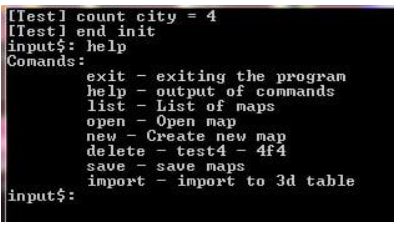
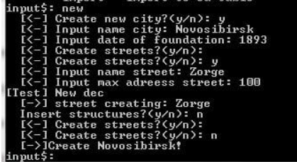
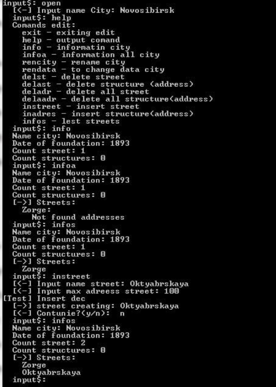

# lab1
## Кацуро Михаил Андреевич
### образование:
- В процессе получения высшего образования - 2 курс СибГУТИ

## Список навыков в области программирования
- C

## Пример работ

### Курсовая работа по структурам и алгоритмам обработки данных 

#### Результат реализация нереляционной базы данных 

